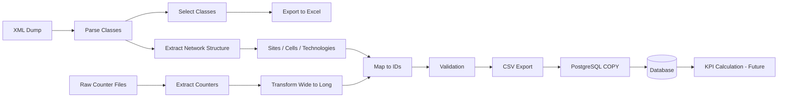

# Network KPI Engine

## Overview

A modular data pipeline for telecom network KPI processing and automation, designed to handle large-scale network data efficiently.

---

## What This Project Solves

Telecom network data is:

* Large in volume
* Complex in structure (XML + wide counter formats)
* Difficult to explore and analyze

This project builds a structured system to:

* Parse network structure
* Transform raw data
* Store it in a relational database
* Prepare it for KPI calculations

---

## Key Features

### XML Processing & Exploration

* Parse telecom XML dumps
* Extract available classes dynamically
* Allow selecting specific classes
* Export selected classes to Excel (one sheet per class)

### Network Data Modeling

* Extract and store:

  * Sites (MRBTS / LNBTS)
  * Cells (LNCEL)
  * Technologies
* Maintain structured relationships in the database

### Counters Definition Pipeline

* Detect counters from raw files
* Compare with database records
* Insert new counters

### Counter Values Ingestion

* Transform data from wide to long format
* Map counters and cells to database IDs
* Normalize timestamp format
* Export processed data to CSV
* High-performance bulk insertion using PostgreSQL COPY

---

## Architecture Overview

---

## Project Structure

* ingestion/      → data loading and transformation
* db/             → database interaction layer
* validation/     → data validation logic
* main.py         → CLI entry point

---

## Current Status

* XML processing & class extraction: ✅ Implemented
* Counters pipeline: ✅ Completed
* Counter values ingestion: ✅ Implemented
* KPI calculations: 🚧 In progress

---

## Roadmap

* KPI calculation pipeline
* Advanced validation rules
* Logging system
* Data quality checks
* Reporting / dashboard

---

## Tech Stack

* Python (pandas)
* PostgreSQL
* psycopg2

---

## Usage

Run the pipeline:

Basic usage:
python main.py

Advanced (module-based):
python -m src.main
